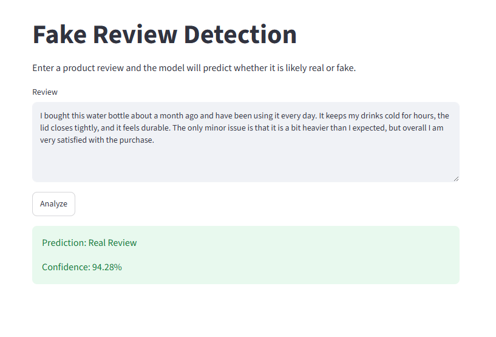
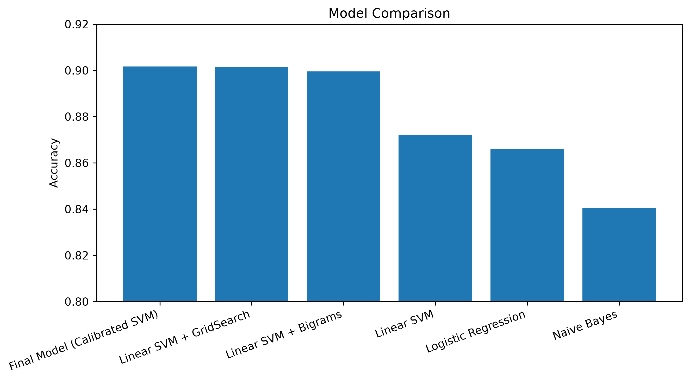

# Fake Review Detection

A machine learning project that classifies product reviews as **human-written** or **AI-generated** using Natural Language Processing (NLP) and classical machine learning models.

The project explores multiple text classification models, compares their performance, and deploys the best-performing model as an interactive Streamlit web application.

## Application Demo



## Features

- Exploratory Data Analysis (EDA)
- Text preprocessing and feature extraction using TF-IDF
- Comparison of multiple machine learning models
- Hyperparameter tuning using GridSearchCV
- Final calibrated Linear SVM model
- Interactive Streamlit web application
- Confidence score for each prediction

## Dataset

The project uses a publicly available dataset containing **40,432 product reviews** collected from multiple Amazon product categories.

The dataset is balanced and contains two classes:

- **OR** – Original human-written reviews
- **CG** – Computer-generated reviews

The reviews cover multiple product categories, including:

- Books
- Electronics
- Movies
- Kitchen
- Home
- Apparel
- Sports
- Health
- Toys
- More...

## Machine Learning Pipeline

The project follows a complete machine learning workflow:

1. Load and explore the dataset.
2. Perform exploratory data analysis (EDA).
3. Extract numerical features from text using **TF-IDF**.
4. Split the dataset into training and testing sets.
5. Train and evaluate multiple machine learning models:
   - Multinomial Naive Bayes
   - Logistic Regression
   - Linear Support Vector Machine (Linear SVM)
6. Improve the best-performing model using:
   - Bigrams
   - GridSearchCV hyperparameter tuning
   - Probability calibration
7. Deploy the final model as an interactive Streamlit application.

## Results

Several machine learning models were evaluated throughout the project.

| Model | Accuracy |
|-------|---------:|
| Naive Bayes | 84.05% |
| Logistic Regression | 86.60% |
| Linear SVM | 87.19% |
| Linear SVM + Bigrams | 89.95% |
| Linear SVM + GridSearch | 90.16% |
| Final Model (Calibrated SVM) | **90.17%** |

The calibrated Linear SVM achieved the best overall performance and was selected as the final model for deployment.

### Model Performance Comparison



## Installation

```bash
pip install -r requirements.txt
```

## Run the Application

```bash
streamlit run app/app.py
```

## Technologies

- Python
- Pandas
- Scikit-learn
- Streamlit
- Matplotlib
- Joblib